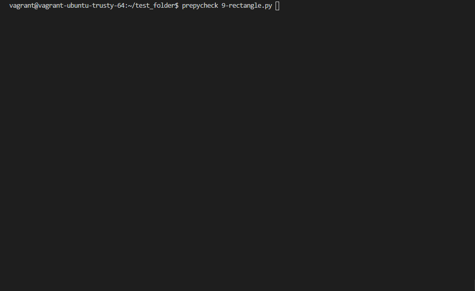

# Prepycheck - Bash script to check basics on python task
[](https://travis-ci.org/joemccann/dillinger)



#  Installation

On Ubuntu run the following command:

    git clone https://github.com/daorejuela1/prepycheck.git; cd prepycheck; sudo ./setup.sh

# Prerequisites 

To run the prepycheck you will need python3 installed
```
sudo apt-get install python3
```
```
sudo apt-get install python3-pip
```
```
pip3 install pep8
```

# Use

To use it select the .py file that you want to analyze in any other case

Check one file:

    prepycheck file.py

Check all files:

    prepycheck


# Example


Coded with love by:
[Steven Brand]([https://github.com/kajoomba99](https://github.com/kajoomba99))  & [Nicolás Álvarez]([https://github.com/NICOLASTOBON](https://github.com/NICOLASTOBON))  & [Laura Villan]([https://github.com/laucavv](https://github.com/laucavv)) & [David Orejuela]([https://github.com/daorejuela1](https://github.com/daorejuela1))
